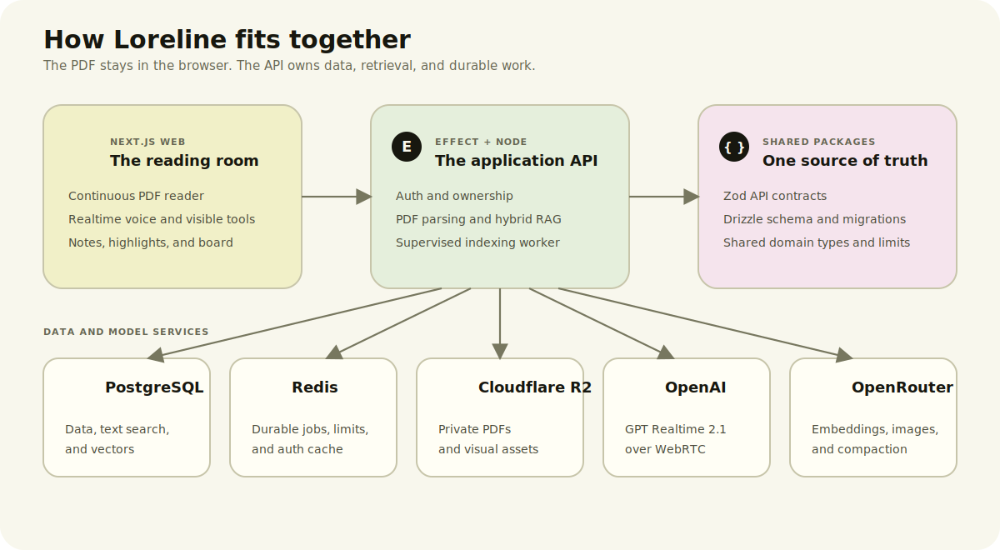
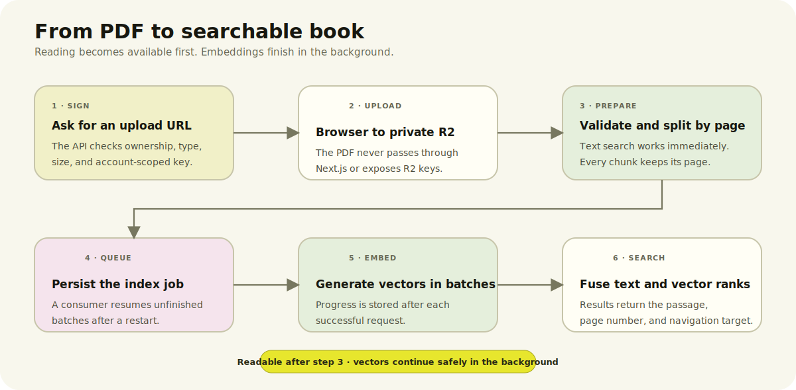

<p align="center">
  
</p>

<h1 align="center">Loreline</h1>

<p align="center"><strong>Read the PDF. Talk to the page. Keep your thinking beside it.</strong></p>

<p align="center">
  Loreline turns a static book into a live reading workspace. The PDF stays in front of you while GPT Realtime 2.1 can inspect the page, search the whole book, focus the exact passage it is discussing, and help you leave behind useful notes, bookmarks, and visual explanations.
</p>

## The demo

1. Upload a PDF. Loreline extracts each page and builds a full-text and embedding index.
2. Read it like a real document: continuous pages, smooth trackpad zoom, selectable text, thumbnails, and outline navigation.
3. Point at something and ask out loud. The voice model receives the page, pointer, selection, and recent conversation.
4. Watch the agent work. It can inspect the rendered page, search the book, scroll to a passage, highlight it, turn pages, and bookmark the page.
5. Keep what matters. Highlights, notes, and generated visuals stay attached to the book instead of disappearing into chat history.
6. Ask a follow-up. Long sessions compact into structured memory, while Tavily is available when the answer needs current information outside the PDF.

## Why it feels different

| | Loreline |
| --- | --- |
| The book stays central | Conversation and tools support the PDF instead of replacing it with a chat transcript. |
| Actions are visible | When the model refers to a passage, Loreline scrolls there and focuses the actual text. |
| Voice can use the interface | GPT Realtime 2.1 calls typed reader tools over WebRTC rather than merely describing what the user should click. |
| Retrieval knows the page | Sentence-aware chunks never cross page boundaries, so every result can navigate back to its source. |
| Pixels are available when needed | The model can request a bounded screenshot of the rendered page, including the live pointer position. |
| Reading leaves useful artifacts | Notes, bookmarks, highlights, and visual explanations remain linked to the book. |

## Architecture



The boundaries are enforced in code:

- `apps/web` is the only Next.js app. Its same-origin `/api` gateway accepts JSON and rejects PDF bodies.
- `apps/server` is an Effect HTTP service with a supervised indexing worker. It has no Next.js runtime dependency.
- `packages/contracts` owns browser-safe Zod contracts, shared limits, and domain types.
- `packages/database` owns the Drizzle schema, pgvector queries, and migrations.
- PDF bytes move directly from the browser to private Cloudflare R2 through short-lived signed URLs.

```bash
npm run verify:architecture
```

## PDF RAG



PDF text is split into page-bound, sentence-aware chunks targeting 2,600 characters with a 260-character overlap. PostgreSQL full-text search is available as soon as parsing completes. A Redis Stream worker then creates embeddings in resumable batches and stores them in pgvector. Search fuses lexical and cosine rankings, keeping the book searchable even while vectors are still being generated.

Index work is durable: Redis consumer groups keep pending jobs, PostgreSQL leases prevent duplicate workers, and progress is committed after every batch. A restart resumes missing vectors rather than beginning again.

## Realtime reader tools

GPT Realtime 2.1 receives compact text context for the current page and calls explicit browser tools:

| Tool | What the reader sees |
| --- | --- |
| `inspect_page` | A visible page inspection with the pointer marked when useful |
| `search_book` | Retrieval across the complete PDF index |
| `focus_passage` | Smooth scroll and focus on the exact quoted text |
| `turn_page` | Reader navigation |
| `bookmark_page` | A real saved-page bookmark |
| `save_highlight_note` | A persistent note attached to selected text |
| `place_note`, `place_visual` | Notes and GPT Image 2 visuals on the thinking board |
| `search_web` | Current information through Tavily when the book is not enough |

The browser connects to OpenAI over WebRTC using a ten-minute ephemeral client secret. Long conversations compact into structured memory before the Realtime context fills up; the current page and active selection always remain fresh.

## Library and reader

- Nested Shelf and Stack folders with breadcrumbs and drag-and-drop moves
- Direct-to-R2 uploads with progress, retry, and PDF validation
- Cover thumbnails rendered from the first PDF page
- Continuous virtualized pages with compositor-only gesture zoom
- PDF outline and thumbnail navigation
- Exact text selection, hover, highlights, saved notes, and bookmarks
- A tabbed board that keeps notes out of the reading area
- Better Auth ownership checks and account-scoped object keys
- TanStack Query for all client server-state and global error handling

## Run locally

Requirements: Node.js 22+, Docker, an R2 bucket, and model credentials for the features you want to run.

```bash
cp .env.example .env
npm install
npm run infra:up
npm run db:migrate
npm run dev
```

Open <http://localhost:3000>.

To run everything in Docker:

```bash
npm run docker:dev
```

If dependencies change while the named `/app/node_modules` volume exists:

```bash
docker compose exec web npm install
```

## Services and models

| Service | Role |
| --- | --- |
| PostgreSQL + pgvector | Books, annotations, full-text search, embeddings, and indexing progress |
| Redis | Auth cache, rate limits, and the durable indexing stream |
| Cloudflare R2 | Private PDFs and generated visuals |
| OpenAI `gpt-realtime-2.1` | Realtime speech, reasoning, and reader tool calls |
| OpenRouter | Embeddings, GPT Image 2 on low quality, and conversation compaction |
| Tavily | Optional current web search |

Copy `.env.example` to `.env`; it documents every variable without containing secrets. The main groups are:

| Variables | Purpose |
| --- | --- |
| `DATABASE_URL`, `REDIS_URL` | Application state and indexing |
| `BETTER_AUTH_SECRET`, `BETTER_AUTH_URL` | Authentication and canonical origin |
| `R2_*` | Private object storage and signed uploads |
| `OPENAI_API_KEY`, `OPENAI_REALTIME_MODEL` | Realtime voice |
| `OPENROUTER_*` | Embeddings, images, and compaction |
| `TAVILY_API_KEY` | Current web search |

## Security

- PDFs are limited to 50 MB and validated by MIME intent, exact R2 size, and `%PDF-` magic bytes.
- Object keys are account-scoped; every book, folder, annotation, and file route checks ownership.
- R2 and model credentials stay server-side. The browser receives only scoped, short-lived credentials.
- Unknown server failures are logged and returned as clean user-facing errors.
- Deleting a book or Stack removes its complete private R2 prefix and dependent database records.
- Expensive upload, indexing, search, image, annotation, and Realtime endpoints are rate-limited per user.

## Checks

```bash
npm run typecheck
npm run lint
npm test -- --run
npm run test:e2e
npm run verify:architecture
npm run build
```
